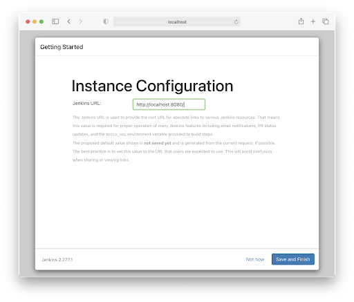
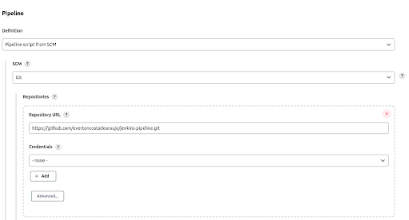

# Jenkins Pipeline com Github

Jenkins é um aplicativo de automação, que é muito usado para Integração Contínua (CI) e Implantação/Entrega Contínua (CD). Este tutorial vai colocar o Jenkins em funcionamento, em sua máquina, e configurar um trabalho básico.

## Setup

### Requisitos
- [Docker](https://docs.docker.com/get-docker/)

### Passos para configurar Jenkins
A maneira mais fácil de colocar o Jenkins em funcionamento é via Docker.
    ``` sh
    docker pull jenkins/jenkins
    ```
Vamos executar a versão Long Term Support (lts) com o seguinte comando:
    ``` sh
    docker run --rm -p 8080:8080 -v "${HOME}/.jenkins:/var/jenkins_home" jenkins/jenkins
    ```
Para entender este comando, vamos:

1. Execute a imagem docker jenkins/jenkins:lts como um contêiner.
2. Nós vamos remover o container assim que terminar através da flag --rm.
3. Mapear a porta 8080 dentro do container em execução com a porta 8080 em nossa máquina. Isso significa que podemos acessar o Jenkins em [localhost:8080](http://localhost:8080).
4. Compartilhe uma pasta chamada ~/.jenkins com a pasta do aplicativo Jenkins /var/jenkins_home dentro do contêiner. Isso significa que podemos reutilizar a pasta quando paramos e iniciamos o Jenkins.
* Caso surja algum problema de permissão de escrita nessa pasta, o comando abaixo deve resolver :
``` sh
    sudo chown -R 1000:1000 .jenkins/
```
Se você navegar agora para http://localhost:8080, você verá esta página:

Como você pode ver, precisamos de uma senha. Se você voltar para onde está executando o comando do Docker, deverá ver alguma saída do terminal. Estamos procurando a senha inicial, que será algo assim:
``` sh
*************************************************************
*************************************************************
*************************************************************

Jenkins initial setup is required. An admin user has been created and a password generated.
Please use the following password to proceed to installation:

45d82938f8c647278083d274b99e64b4

This may also be found at: /var/jenkins_home/secrets/initialAdminPassword

*************************************************************
*************************************************************
*************************************************************
```
Copie a senha. Volte para o seu navegador e cole a senha. Depois de fazer isso, você verá algumas opções em torno de plugins.

Por enquanto, continue e selecione “Install suggested plugins”. Em seu próprio tempo, talvez brinque com a seleção do seu próprio e veja o que acontece. Descobri que os plugins provavelmente dependem das linguagens, estruturas e ferramentas que você está usando.

O processo de instalação agora instalará os plugins sugeridos. Quando isso estiver concluído, ele solicitará os detalhes do usuário administrador.

Você pode, se quiser, clicar em “Skip and continue as admin”. Se você fizer isso, precisará se lembrar da senha inicial. Se você esquecer, poderá obter a senha inicial executando o seguinte comando em sua máquina host:
``` sh
cat ~/.jenkins/secrets/initialAdminPassword
```
A tela final de instalação confirma a URL que será usada para acessar a instância do Jenkins.

Clique “Save and Finish”.
Agora você tem uma instância do Jenkins em execução localmente.

### Configurando seu primeiro pipeline
Para garantir que estamos na mesma página, clique no logotipo do Jenkins no canto superior esquerdo. Isso deve nos trazer de volta à página inicial.
Clique em “New Item” no canto superior esquerdo da tela. Chame o item como quiser, mas aqui foi chamado “SimplePipeline” e selecione a opção “Pipeline”. Em seguida, clique em OK.

A página de configuração será aberta, e vamos criar primeiramente um pipeline simples.
Na seção “Pipeline”, selecione a opção “Pipeline script” no campo “Definition”, e na caixinha abaixo, no canto superior direito selecione a opção “Hello World”. Um script de pipeline será criado.
Nesse [link](https://www.jenkins.io/doc/book/pipeline/jenkinsfile/), é possível entender melhor a sintaxe do arquivo de configuração do pipeline. Mas, resumidamente, devemos criar os estágios que queremos que sejam executados toda vez que for pedido para rodar o pipeline. Nesse caso, temo apenas um estágio e apenas um comando a ser executado.
Clique em “Save”.

Após criado o script de pipeline, agora podemos fazer um “build” do nosso pipeline, clicando em “Build Now” no canto superior esquerdo.

Parabéns! Você criou e executou seu primeiro pipeline com o Jenkins!

Após a execução desse build, você consegue visualizar o histórico e o “Stage View” de cada execução do pipeline que você fizer. Clicando sobre a caixa verde, aparecerá a opção “Logs” e ao clicar nela, você pode visualizar os logs emitidos durante a execução do pipeline.

Agora vamos integrar nosso pipeline com um repositório!
Para isso, vamos ao local em que o repositório está localizado no Github e vamos criar um arquivo com as configurações do pipeline.
O arquivo a seguir pode ser criado na pasta raiz do repositório, com nome “Jenkinsfile”, e deve ter a mesma estrutura do arquivo que foi criado no nosso primeiro pipeline, porém vamos adicionar mais estágios e ele terá a seguinte estrutura:
``` sh
pipeline {
    agent any

    stages {
        stage('Build') {
            steps {
                echo 'Build App'
            }
        }
    
        stage('Test') {
            steps {
                echo 'Test App'
            }
        }
    
        stage('Deploy') {
            steps {
                echo 'Deploy App'
            }
        }
    }
}
```
Nesse arquivo temos os estágios Build, Test e Deploy com um comando simples apenas para testar cada estágio em execução, entretanto você pode colocar os comandos que desejar para seu pipeline.

Voltando à nossa interface do Jenkins, nas configurações do pipeline que criamos, desça até a seção “Pipeline” e no campo “Definition” selecione a opção “Pipeline script from SCM”.
No campo “SCM”, selecione a opção “Git”.
Adicione a URL do repositório no campo “Repository URL”. É importante que o repositório seja público para que não haja necessidade de adicionar credenciais de acesso, nesse caso. Também existem outras configurações que podem ser feitas de acordo com as necessidades do projeto, mas vamos tentar simplificar o máximo possível para entendermos.

Mais abaixo nas configurações, certifique-se de que o campo “Script Path” contém o caminho correto do arquivo que criamos no nosso repositório, que no caso é “Jenkinsfile”.

Agora com as configurações corretas, é possível rodar o pipeline novamente e enxergar os três estágios que criamos, mais um estágio de checkout de SCM.

Mas ainda falta configurar o pipeline para ser executado toda vez que alguma mudança acontecer no repositório que ele está integrado, para isso vamos às configurações novamente e na seção “Build Triggers” e selecione a opção “Poll SCM”. Quando selecionada, uma caixa de texto “Schedule” será aberta e nela vamos inserir cinco asteriscos com espaço entre eles:
``` sh
* * * * *
```

Clique em “Save” e pronto! Agora é só fazer alguma alteração no repositório que você integrou que em segundos você verá um novo build acontecer.

Clicando no número do build, você consegue visualizar mais informações sobre esse build, como a identificação do commit que o engatilhou e a mensagem desse commit.

Parabéns!
Você aprendeu a construir um pipeline com o Jenkins integrado a um repositório do Github.

